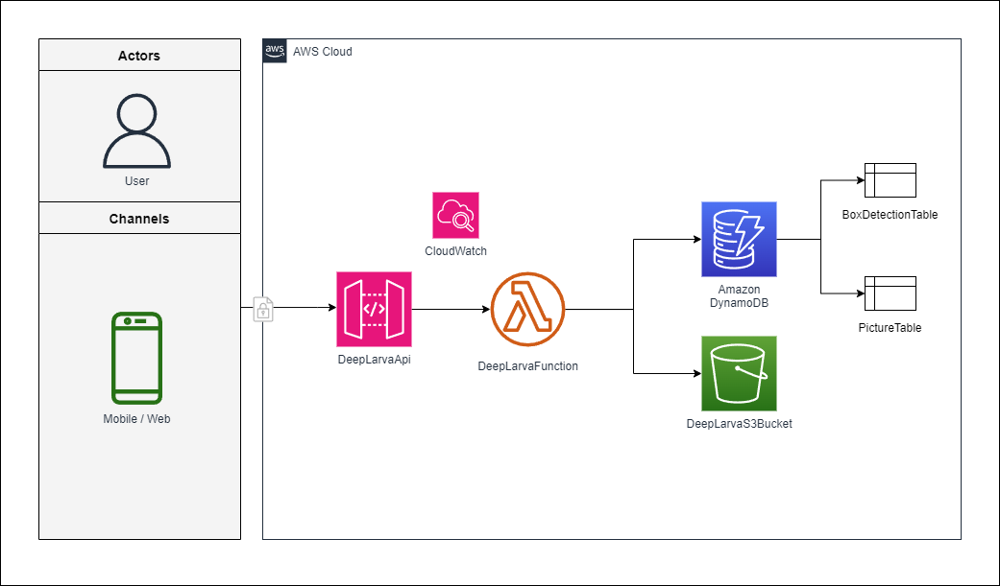

# deep-larva-server

### Run locally

```bash
python local.py
```

> 🗒️ **Notes:** There is a VSCode debug launcher ready to use, just activate your virtualenv with dependencies and run debug mode.

### Deploy infraestructure

```bash
sam deploy
```

## Architecture Preview


